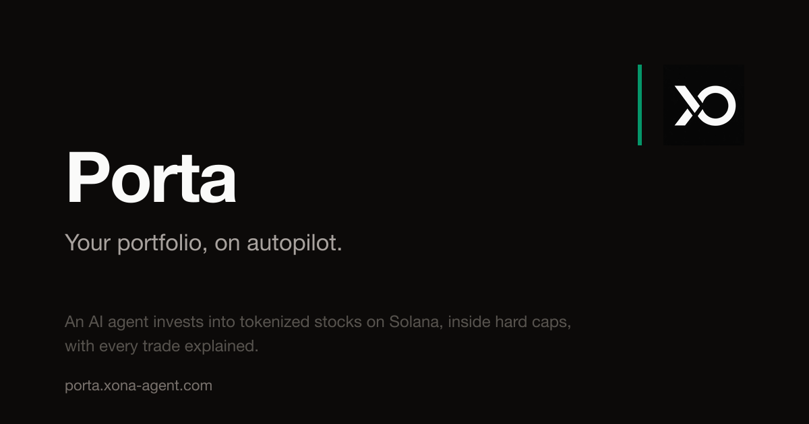

# Porta

**Your portfolio, on autopilot. Capped, explained, on Solana.**



Porta is an AI robo-advisor for tokenized stocks (xStocks). Sign in with your email, pick stocks and a daily amount, fund your dedicated agent wallet with USDC, and an agent invests for you around the clock: pacing buys through the day, refusing overpriced entries, pausing on bearish signals, and writing down the reasoning behind every trade.

**Live app**: [porta.xona-agent.com](https://porta.xona-agent.com)
**Live demo portfolio** (real trades on mainnet, no login needed): [porta.xona-agent.com/demo](https://porta.xona-agent.com/demo)

Built by [Xona Labs](https://github.com/xona-labs) for the Solana tokenized stocks hackathon.

## Why this beats a brokerage app

- **24/7 investing.** xStocks trade around the clock on Solana. Porta's engine runs every 30 minutes, weekends included.
- **Hard caps, not promises.** Per-trade and rolling 24-hour spending caps are enforced in a durable ledger before any transaction is signed. The agent physically cannot overspend.
- **The premium guard.** Tokenized stocks can trade above or below the price of the underlying. Porta reads the live premium/discount for every xStock and refuses to buy when the token trades rich, so your DCA never overpays for wrapped exposure.
- **Every trade explained.** Each buy records the signal sentiment, the premium reading, and the remaining cap headroom that justified it. Skipped cycles are logged with their reasons too.
- **An isolated agent wallet per user.** Signing in generates a fresh wallet just for your agent. You fund it with only what you are willing to automate; your main wallet is never touched. Wallet secrets are AES-256-GCM encrypted at rest and decrypted only inside the trade cycle. Delegated signing against the user's own wallet is the production path on the roadmap.

## How it works

```
Privy email login ──> agent wallet generated (encrypted at rest)
        |
Cloudflare cron (30 min)
        v
  fetch signals ──────── Xona signal feed (sentiment, confidence,
        v                premium/discount per xStock)
  decide per stock (budget pacing)
        - each stock has a rolling 24h allocation
        - skip if on pace, bearish, or trading rich vs the underlying
        - clamp to the per-trade cap and the 24h cap (durable D1 ledger)
        - skip if the wallet needs a deposit
        v
  swap USDC -> xStock ── @xona-labs/xpay (Jupiter execution)
        v
  record trade + lot + reasoning, snapshot equity (D1)
        v
  dashboard reads it all back
```

## Stack

- **Cloudflare Workers** for the engine (cron triggers) and API (Hono)
- **Cloudflare D1** for users, sessions, the trade ledger, cost-basis lots, spend caps, and equity history
- **[Privy](https://privy.io)** for email login (JWT verified server-side via JWKS)
- **[@xona-labs/xpay](https://www.npmjs.com/package/@xona-labs/xpay)** for wallet, signing, and Jupiter swap execution
- **Xona signal feed** for stock sentiment and xStock premium/discount
- **React + Vite + Tailwind** dashboard served as Worker assets

## Running it

```sh
npm install
npm --prefix web install

# create the database, then paste its id into wrangler.jsonc
npx wrangler d1 create porta
npm run db:migrate:local

npm run dev            # worker on :8787
npm run web:dev        # dashboard on :5173, proxies /api
```

Set the local secrets (copy `.dev.vars.example` to `.dev.vars`):

```sh
openssl rand -base64 32   # use as MASTER_KEY
```

Trades are **simulated by default** (`DRY_RUN=true` in `.dev.vars` for local work). To trade for real, set `DRY_RUN` to `"false"` in `wrangler.jsonc`, put the secrets, and deploy:

```sh
npx wrangler secret put MASTER_KEY
npx wrangler secret put SOLANA_RPC_URL   # recommended, a dedicated RPC
npx wrangler secret put ADMIN_TOKEN      # optional, locks the manual cycle trigger
npm run db:migrate
npm run deploy
```

### Programmatic onboarding

The dashboard uses Privy login, but agents and scripts can onboard directly:

```sh
# 1. Create a user. Save the token; it is shown exactly once.
curl -X POST https://porta.xona-agent.com/api/users -H 'content-type: application/json' \
  -d '{ "label": "my-agent" }'
# -> { "user_id": "...", "token": "...", "deposit_address": "..." }

# 2. Fund the deposit address with USDC on Solana.

# 3. Configure the plan.
curl -X PUT https://porta.xona-agent.com/api/me/config \
  -H "authorization: Bearer $TOKEN" -H 'content-type: application/json' -d '{
  "basket": [
    { "ticker": "AAPL", "weight": 0.5 },
    { "ticker": "SPY",  "weight": 0.5 }
  ],
  "daily_budget_usd": 10,
  "max_per_tx_usd": 1,
  "max_per_day_usd": 10
}'
```

The agent starts buying on the next cycle. `GET /api/me/trades` returns every trade with its reasoning.

## Safety model

1. **Dry run by default.** Nothing is signed until a MASTER_KEY is set and dry run is disabled.
2. **Isolated wallets.** Each user's agent trades only from its own capped allowance wallet; exposure is bounded by what you deposit and the caps you set.
3. **Wallet secrets are encrypted at rest** (AES-256-GCM under a Worker secret) and decrypted only inside the trade cycle. Session tokens are stored as SHA-256 hashes.
4. **Caps live in D1**, not in process memory, so restarts and redeploys never reset the daily limit.
5. **The premium guard is checked per buy** using the live on-chain price versus the underlying.
6. **Bearish signals pause buying** for that ticker; the skip and its reason are logged like any trade.

## License

MIT
